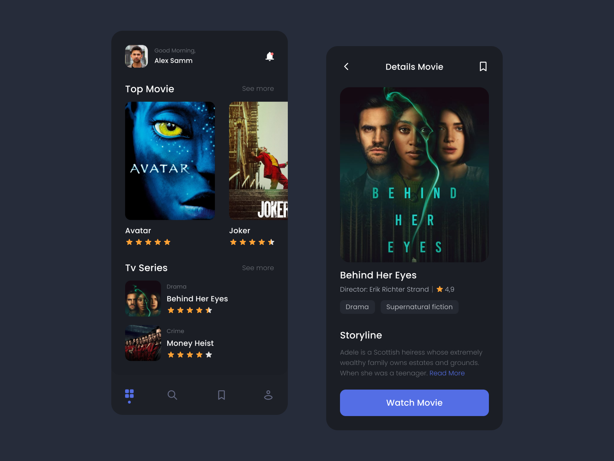

# Flutter Mozi Movie App

Aplikasi Flutter ini berguna untuk memberikan informasi seputar film / series secara dinamis dengan menggunakan TMDB API.

- [x] Home Page
- [x] Movie Details Page
- [ ] Third Page
- [ ] Fourth Page

<table>
  <tr>
    <td valign="top"> </td>
  </tr>
</table>

Assets From:
- TMDB API => https://www.themoviedb.org/
- UI Kit => https://pixel.buildwithangga.com/details/mozi-movie-streaming-ui-kit-mobile

## Author
[@ahmoodrzl](https://www.instagram.com/ahmoodrzl/ "Instagram") / Ahmad Rizal Imaduddin

## Getting Started

This project is a starting point for a Flutter application.

A few resources to get you started if this is your first Flutter project:

- [Lab: Write your first Flutter app](https://flutter.dev/docs/get-started/codelab)
- [Cookbook: Useful Flutter samples](https://flutter.dev/docs/cookbook)

For help getting started with Flutter, view our
[online documentation](https://flutter.dev/docs), which offers tutorials,
samples, guidance on mobile development, and a full API reference.
